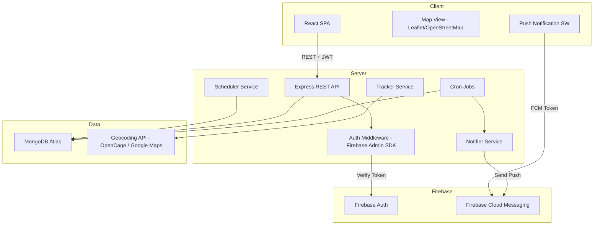

# Design Document: Food Waste to Hunger Solution

## Overview

The Food Waste to Hunger Solution is a full-stack web application that connects restaurants with surplus food to NGOs and volunteers who redistribute it to people in need. Built on the MERN stack (MongoDB, Express, React, Node.js) with Firebase for authentication and real-time messaging, the platform provides GPS-based listing discovery, real-time push notifications, pickup scheduling, expiry tracking, and a mutual rating system.

### Key Design Goals

- Sub-30-second notification delivery from listing creation to recipient devices
- Accurate GPS-based proximity filtering with configurable radius
- Atomic claim operations to prevent double-booking
- Reliable expiry enforcement via scheduled background jobs
- Role-based access control enforced at both API and UI layers

---

## Architecture

The system follows a three-tier architecture: a React SPA on the client, a Node.js/Express REST API on the server, and MongoDB as the primary data store. Firebase Auth handles identity, and Firebase Cloud Messaging (FCM) handles push notifications. A background job runner (node-cron) handles expiry enforcement and reminder alerts.



### Technology Choices

| Concern | Choice | Rationale |
|---|---|---|
| Frontend | React 18 + Vite | Fast HMR, component ecosystem |
| Routing | React Router v6 | Standard SPA routing |
| State | Zustand | Lightweight, no boilerplate |
| Map | Leaflet + React-Leaflet | Open-source, no API key for tiles |
| Backend | Node.js + Express | Matches MERN requirement |
| Auth | Firebase Auth | Handles OAuth, JWT issuance, token refresh |
| Database | MongoDB Atlas | Flexible schema, geospatial index support |
| Push | Firebase Cloud Messaging | Cross-browser push, free tier |
| Geocoding | OpenCage Geocoding API | Affordable, accurate |
| Background Jobs | node-cron | Lightweight in-process scheduler |
| File Storage | Firebase Storage | Photo uploads for listings |

---

## Components and Interfaces

### Client Components

```
src/
  components/
    auth/         LoginForm, RegisterForm, OAuthButton
    listings/     ListingCard, ListingForm, ListingMap, ListingList
    claims/       ClaimModal, ClaimHistory
    notifications/ NotificationBell, NotificationItem
    ratings/      RatingPrompt, StarRating, RatingDisplay
    profile/      ProfilePage, LocationSettings, ImpactStats
    admin/        AdminDashboard, UserTable, ListingModeration
  pages/
    HomePage, MapPage, ListingDetailPage, ProfilePage, AdminPage
  hooks/
    useAuth, useListings, useNotifications, useGeolocation
  services/
    api.js        Axios instance with auth interceptor
    fcm.js        FCM token registration and foreground handler
```

### Server Modules

```
src/
  routes/
    auth.js       POST /auth/register, POST /auth/sync
    listings.js   CRUD for /listings
    claims.js     POST /claims, DELETE /claims/:id, PATCH /claims/:id/complete
    ratings.js    POST /ratings, GET /ratings/:userId
    users.js      GET/PATCH /users/:id, admin routes
    admin.js      GET /admin/stats, PATCH /admin/users/:id
  services/
    notifier.js   Proximity query + FCM dispatch
    scheduler.js  Claim validation logic
    tracker.js    Geocoding + geospatial helpers
  jobs/
    expiryJob.js  Cron: mark expired listings, send reminders
  middleware/
    auth.js       Firebase token verification
    roles.js      Role-based route guard
```

### REST API Surface

| Method | Path | Auth | Description |
|---|---|---|---|
| POST | /auth/sync | Firebase token | Upsert user profile after Firebase registration |
| GET | /listings | Optional | List active listings with geo filter |
| POST | /listings | Restaurant | Create listing |
| PATCH | /listings/:id | Restaurant (owner) | Update listing (extend expiry) |
| DELETE | /listings/:id | Restaurant (owner) / Admin | Remove listing |
| POST | /claims | NGO / Volunteer | Claim a listing |
| DELETE | /claims/:id | Claimant | Cancel claim |
| PATCH | /claims/:id/complete | Restaurant or Claimant | Mark pickup complete |
| POST | /ratings | Authenticated | Submit rating |
| GET | /users/:id | Authenticated | Get user profile |
| PATCH | /users/:id/location | Authenticated | Update saved location |
| GET | /admin/stats | Admin | Platform statistics |
| PATCH | /admin/users/:id | Admin | Deactivate / reactivate user |
| DELETE | /admin/listings/:id | Admin | Remove listing |
| DELETE | /admin/ratings/:id | Admin | Remove rating |

---

## Data Models

### User

```js
{
  _id: ObjectId,
  firebaseUid: String,          // unique index
  email: String,                // unique index
  displayName: String,
  role: "restaurant" | "ngo" | "volunteer" | "admin",
  isActive: Boolean,            // default true; admin can deactivate
  location: {
    type: "Point",
    coordinates: [Number, Number]  // [lng, lat]
  },
  savedAddress: String,         // human-readable
  notificationRadius: Number,   // km, default 10
  fcmTokens: [String],          // registered push tokens
  pushEnabled: Boolean,
  averageRating: Number,        // denormalized, recalculated on new rating
  ratingCount: Number,
  completedPickups: Number,     // denormalized counter
  totalListingsCreated: Number, // restaurants only
  totalWeightRescued: Number,   // kg, denormalized
  createdAt: Date,
  updatedAt: Date
}
// Indexes: firebaseUid (unique), email (unique), location (2dsphere)
```

### Listing

```js
{
  _id: ObjectId,
  restaurantId: ObjectId,       // ref: User
  foodName: String,
  quantity: Number,             // > 0
  unit: String,                 // e.g. "kg", "portions"
  description: String,
  photoUrls: [String],          // Firebase Storage URLs
  location: {
    type: "Point",
    coordinates: [Number, Number]
  },
  pickupWindowStart: Date,
  expiryAt: Date,
  status: "available" | "claimed" | "expired" | "completed",
  claimId: ObjectId | null,     // ref: Claim
  createdAt: Date,
  updatedAt: Date
}
// Indexes: location (2dsphere), status, expiryAt, restaurantId
```

### Claim

```js
{
  _id: ObjectId,
  listingId: ObjectId,          // ref: Listing
  claimantId: ObjectId,         // ref: User
  scheduledPickupTime: Date,
  status: "active" | "cancelled" | "completed",
  completedAt: Date | null,
  createdAt: Date,
  updatedAt: Date
}
// Indexes: listingId, claimantId
```

### Rating

```js
{
  _id: ObjectId,
  claimId: ObjectId,            // ref: Claim (unique per rater)
  raterId: ObjectId,            // ref: User
  rateeId: ObjectId,            // ref: User
  stars: Number,                // 1–5
  comment: String,              // max 500 chars, optional
  createdAt: Date
}
// Indexes: claimId + raterId (unique compound), rateeId
```

### Notification (in-app log)

```js
{
  _id: ObjectId,
  recipientId: ObjectId,        // ref: User
  type: "new_listing" | "claim_confirmed" | "expiry_reminder" | "pickup_complete" | "claim_cancelled",
  payload: Object,              // flexible: listingId, claimId, message text
  read: Boolean,
  createdAt: Date
}
// Indexes: recipientId + read, createdAt
```

### Geospatial Strategy

All location fields use GeoJSON `Point` format with a `2dsphere` index. Proximity queries use MongoDB's `$nearSphere` operator with `$maxDistance` in meters. This enables efficient radius-based listing discovery and notification targeting without a separate spatial service.

```js
// Example: find listings within 10 km of user
db.listings.find({
  location: {
    $nearSphere: {
      $geometry: { type: "Point", coordinates: [lng, lat] },
      $maxDistance: 10000  // meters
    }
  },
  status: "available"
})
```

---

## Correctness Properties

*A property is a characteristic or behavior that should hold true across all valid executions of a system — essentially, a formal statement about what the system should do. Properties serve as the bridge between human-readable specifications and machine-verifiable correctness guarantees.*


### Property 1: Listing Creation Round-Trip

*For any* valid listing payload (food name, quantity > 0, unit, description, future expiry, GPS coordinates), creating a listing and then fetching it by ID should return all submitted fields unchanged, with status set to "available" and coordinates matching the submitted GPS point.

**Validates: Requirements 2.1, 2.2, 2.5**

---

### Property 2: Listing Validation Rejects Invalid Inputs

*For any* listing submission where the expiry datetime is in the past, or where the quantity is less than or equal to zero, the platform must reject the request and return a validation error without creating a listing record.

**Validates: Requirements 2.3, 2.4**

---

### Property 3: Expiry Job Marks Expired Listings

*For any* listing with status "available" whose expiryAt datetime is in the past, running the expiry job must set that listing's status to "expired" and create a notification record for the creating restaurant.

**Validates: Requirements 2.7, 6.3**

---

### Property 4: Proximity Query Correctness

*For any* listing GPS location, configured radius, and set of users with known saved locations, the proximity query must return exactly those users whose saved location is within the radius and exclude all users outside it.

**Validates: Requirements 3.1**

---

### Property 5: Notification Delivery Completeness

*For any* new listing and any set of eligible nearby users, each eligible user must receive an in-app notification record containing food name, quantity, restaurant name, distance in kilometers, and time remaining until expiry. For any eligible user with pushEnabled set to true, the FCM dispatch function must also be called with that user's registered token.

**Validates: Requirements 3.2, 3.3, 3.4**

---

### Property 6: Notification Retry on Failure

*For any* notification delivery attempt that fails, the notifier must retry exactly 3 times before logging the failure, and must not retry a 4th time.

**Validates: Requirements 3.5**

---

### Property 7: Search Filter Excludes Non-Available Listings

*For any* search or map query, all returned listings must have status "available". No listing with status "expired", "claimed", or "completed" may appear in active search results.

**Validates: Requirements 4.2, 4.5**

---

### Property 8: List Sort Order Correctness

*For any* set of listings sorted by distance, each consecutive pair must satisfy distance[i] ≤ distance[i+1]. For any set of listings sorted by time remaining until expiry, each consecutive pair must satisfy timeRemaining[i] ≤ timeRemaining[i+1].

**Validates: Requirements 4.4**

---

### Property 9: Claim Creation Round-Trip

*For any* valid claim payload (claimant identity, listing reference, pickup time within the allowed window), creating a claim and then fetching it must return the claimantId, listingId, and scheduledPickupTime unchanged, with status "active".

**Validates: Requirements 5.1**

---

### Property 10: Claim Exclusivity

*For any* listing that has been successfully claimed, any subsequent claim attempt on that same listing must be rejected with an error, regardless of the claimant's identity.

**Validates: Requirements 5.2**

---

### Property 11: Claim Notifications to Both Parties

*For any* successfully created claim, both the claimant and the listing's restaurant must each have a notification record created containing the claimant's name and scheduled pickup time.

**Validates: Requirements 5.3**

---

### Property 12: Pickup Window Validation

*For any* claim attempt where the scheduled pickup time is outside the listing's pickup window or is after the listing's expiry datetime, the scheduler must reject the request and return a descriptive error without creating a claim record.

**Validates: Requirements 5.4, 5.5**

---

### Property 13: Claim Cancellation Restores Listing Availability

*For any* active claim that is cancelled before the scheduled pickup time, the associated listing's status must be set back to "available", and the restaurant must receive a cancellation notification.

**Validates: Requirements 5.6**

---

### Property 14: Expiry Reminder Job Targets Eligible Users

*For any* listing with status "available" and less than 2 hours remaining until expiry, the reminder job must create notification records for all NGO and Volunteer users whose saved location is within the configured radius of the listing.

**Validates: Requirements 6.2**

---

### Property 15: Expiry Extension Validation

*For any* extension request on an "available" listing, if the requested new expiry datetime is more than 4 hours after the original expiry, the request must be rejected. If the new expiry is within 4 hours of the original, the request must succeed and the listing's expiryAt must be updated.

**Validates: Requirements 6.5**

---

### Property 16: Rating Window Enforcement

*For any* completed pickup, a rating submission within 48 hours of the completion timestamp must be accepted. A rating submission more than 48 hours after the completion timestamp must be rejected.

**Validates: Requirements 7.1**

---

### Property 17: Rating Input Validation

*For any* rating submission where the stars value is not in the set {1, 2, 3, 4, 5}, or where the comment length exceeds 500 characters, the platform must reject the submission and return a validation error.

**Validates: Requirements 7.2**

---

### Property 18: Duplicate Rating Rejection

*For any* completed pickup and any rater, submitting a second rating for the same (claimId, raterId) pair must be rejected with an error, and the original rating must remain unchanged.

**Validates: Requirements 7.3**

---

### Property 19: Average Rating Correctness

*For any* user and any set of ratings submitted for that user, the stored averageRating must equal the arithmetic mean of all stars values rounded to two decimal places, and ratingCount must equal the total number of ratings. This invariant must hold immediately after each new rating is submitted.

**Validates: Requirements 7.4, 7.5**

---

### Property 20: Rating Threshold Enforcement

*For any* user account with fewer than 3 completed pickups, the public profile API response must not include the averageRating field.

**Validates: Requirements 7.6**

---

### Property 21: Pickup Completion Authorization and Timestamp

*For any* active claim, marking it as completed must succeed when requested by the restaurant owner or the claimant, and must fail with a 403 error when requested by any other user. Upon successful completion, the claim's completedAt timestamp must be set to a non-null datetime.

**Validates: Requirements 8.1, 8.2**

---

### Property 22: History Completeness

*For any* restaurant with past listings, the listing history API must return each listing's status, claimant name (if claimed), and completedAt timestamp. For any NGO or Volunteer with past claims, the claim history API must return each claim's listing details, restaurant name, and completedAt timestamp.

**Validates: Requirements 8.3, 8.4**

---

### Property 23: Impact Statistics Consistency

*For any* user, the profile's totalWeightRescued, completedPickups, and totalListingsCreated (for restaurants) must match the actual counts derived from their claim and listing records in the database.

**Validates: Requirements 8.5**

---

### Property 24: Geocoding Round-Trip

*For any* valid address string that the geocoding service can resolve, submitting it as the user's location must result in the user's location.coordinates being set to non-null values, and a subsequent fetch of the user's profile must return those same coordinates.

**Validates: Requirements 9.3, 9.5**

---

### Property 25: Geocoding Error Propagation

*For any* geocoding service failure (network error or unresolvable address), the update location endpoint must return an error response and must not update the user's stored coordinates.

**Validates: Requirements 9.4**

---

### Property 26: Admin Role Enforcement

*For any* user whose role is not "admin", all requests to admin-only endpoints must return a 403 Forbidden response, regardless of the request payload or method.

**Validates: Requirements 10.1**

---

### Property 27: Deactivated User Listing Exclusion

*For any* user account that has been deactivated by an admin, none of that user's listings may appear in any public listing search result or map query.

**Validates: Requirements 10.3**

---

### Property 28: Password Length Validation

*For any* registration attempt where the password string has fewer than 8 characters, the registration must be rejected with a validation error. For any password with 8 or more characters, the length check must pass.

**Validates: Requirements 1.2**

---

### Property 29: Expired Token Rejection

*For any* HTTP request to an authenticated endpoint that carries an expired session token, the server must respond with a 401 Unauthorized status and must not process the request.

**Validates: Requirements 1.5**

---

## Error Handling

### Validation Errors (400)
All input validation failures return a consistent JSON shape:
```json
{ "error": "VALIDATION_ERROR", "field": "expiryAt", "message": "Expiry must be in the future" }
```
The `field` key is omitted for auth errors to avoid revealing which credential is wrong (Requirement 1.3).

### Authentication Errors (401)
Expired or missing tokens return `{ "error": "UNAUTHORIZED" }`. The middleware verifies the Firebase ID token on every protected route using the Firebase Admin SDK.

### Authorization Errors (403)
Role guard middleware checks `req.user.role` against the required roles array. Returns `{ "error": "FORBIDDEN" }`.

### Not Found (404)
Resource lookups that return null return `{ "error": "NOT_FOUND", "resource": "listing" }`.

### Conflict (409)
Duplicate claim attempts and duplicate rating submissions return `{ "error": "CONFLICT", "message": "..." }`.

### Geocoding Failures
When the geocoding service returns no results or a network error, the Tracker service throws a typed `GeocodingError`. The route handler catches it and returns 422 with a user-facing message prompting re-entry.

### Notification Failures
The Notifier service wraps FCM calls in a try/catch with exponential backoff (delays: 1s, 2s, 4s). After 3 failures, the error is logged to the server console with the recipient ID and listing ID for manual investigation. Notification failures are non-fatal and do not roll back the listing creation transaction.

### Cron Job Failures
The expiry job logs errors per-listing and continues processing remaining listings. A failed update on one listing does not abort the batch.

---

## Testing Strategy

### Unit Tests (Jest)

Focus on pure functions and service logic with mocked dependencies:

- Tracker service: geocoding, distance calculation, `$nearSphere` query construction
- Scheduler service: pickup window validation, expiry extension validation
- Notifier service: notification payload construction, retry logic (mock FCM)
- Rating service: average calculation, threshold enforcement
- Auth middleware: token verification (mock Firebase Admin SDK)
- Expiry job: listing selection query, status update logic

### Property-Based Tests (fast-check)

The project uses [fast-check](https://github.com/dubzzz/fast-check) for property-based testing. Each property test runs a minimum of 100 iterations.

Each test is tagged with a comment in the format:
`// Feature: food-waste-hunger-solution, Property N: <property_text>`

Properties to implement as property-based tests:

| Property | fast-check Arbitraries |
|---|---|
| P1: Listing round-trip | `fc.record({ foodName: fc.string(), quantity: fc.integer({min:1}), ... })` |
| P2: Listing validation | `fc.date({max: new Date()})` for past expiry; `fc.integer({max:0})` for invalid qty |
| P4: Proximity query | `fc.array(fc.record({ lat: fc.float, lng: fc.float }))` |
| P7: Search filter | `fc.array(fc.constantFrom("available","claimed","expired","completed"))` |
| P8: Sort order | `fc.array(fc.record({ distance: fc.float({min:0}) }))` |
| P10: Claim exclusivity | `fc.array(fc.record({ claimantId: fc.uuid() }), {minLength:2})` |
| P12: Pickup window | `fc.date()` for pickup times relative to window |
| P17: Rating validation | `fc.integer()` for stars; `fc.string({maxLength:600})` for comments |
| P18: Duplicate rating | `fc.uuid()` for claimId/raterId pairs |
| P19: Average rating | `fc.array(fc.integer({min:1,max:5}), {minLength:1})` |
| P26: Admin enforcement | `fc.constantFrom("restaurant","ngo","volunteer")` for non-admin roles |
| P28: Password length | `fc.string()` with length checks |
| P29: Expired token | `fc.date({max: new Date()})` for token expiry |

### Integration Tests

Run against a local MongoDB instance and mocked Firebase:

- Full listing creation → claim → complete → rate flow
- Expiry job end-to-end with real MongoDB queries
- Proximity notification targeting with seeded user locations
- Admin deactivation hiding listings from search

### Frontend Tests (Vitest + React Testing Library)

- Component rendering: ListingCard, RatingPrompt, NotificationBell
- Hook behavior: useGeolocation (mock navigator.geolocation), useAuth
- Map marker rendering with mock listing data
- Form validation feedback

### Test Configuration

```js
// jest.config.js (server)
module.exports = {
  testEnvironment: "node",
  setupFilesAfterFramework: ["./tests/setup.js"],
};

// vitest.config.js (client)
export default { test: { environment: "jsdom" } };
```
